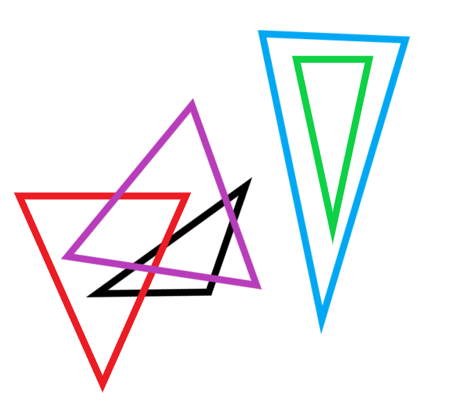

# Tasks for internship

- `Task 1` - implemented algorithm to detect colision between 2 triangles
- `Task 2` - simulation of rotating rectangle and circle with colision detection
- `Task 3` - cropping whitespaces at the begining and the end of given string

### Task 1

```cpp
bool isColliding(const Triangle& triangle1, const Triangle& triangle2);
```

Function checks if 2 triangles (struct Triangle implemented) are colliding. To test algorithm checked different situation as shown below:



### Task 2

Simulation was made with SFML. Collision can be checked using only corners of rectangle (approx) or with every collision.


### Task 3

Function `cropp` was made to work with containers and string literals. It modifies given string (can be other container) or returns result if given parameter was const.
